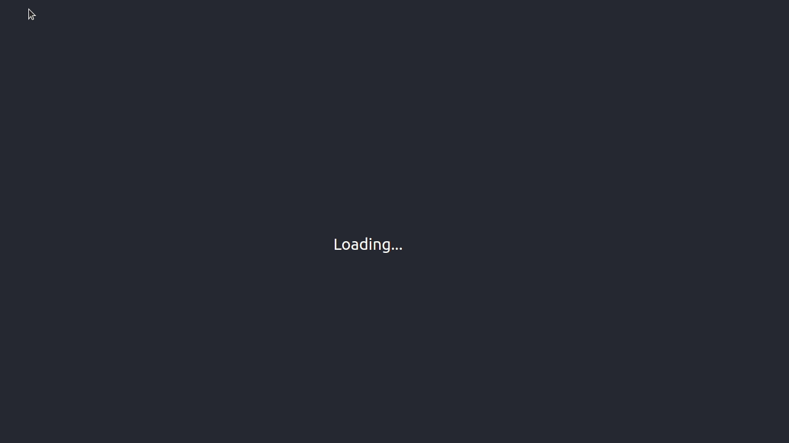

This project is a tutorial on how to make a Quiz App using React and Open Trivia DB API. The full video of this tutorial can be found on : <a href="https://youtu.be/Oi763-xb074">Click Here</a> (Right Click & Open in New Tab)

## Demo

In the project directory, you can run:

First clone this repo using
### `git clone <this-repo>`

and then install the dependencies using
### `npm i`

Finally run the development server using
### `npm start`